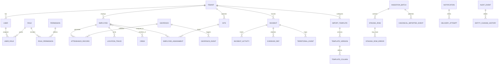

# 03 — Modelo conceptual

Descripción de entidades de negocio y sus relaciones a nivel conceptual (sin atarse a una sola base física).

## Dominios

## Entidades núcleo

### Plataforma
- **Tenant** — cliente empresa; ancla de multi-tenancy.
- **User** — credenciales y perfil de acceso (identity-service).
- **Role / Permission** — RBAC.

### Operaciones de campo
- **Employee** — trabajador con código, documento, cargo.
- **Site** — instalación con geolocalización.
- **Crew** — cuadrilla operativa.
- **AttendanceRecord** — evento check-in/out con validación geográfica opcional.

### Territorio y seguridad
- **LocationTrace** — punto GPS en el tiempo.
- **Geofence** — polígono o círculo de control.
- **Incident** — hecho operativo o de seguridad.
- **TerritorialEvent** — evento geográfico para capas de mapa.

### Importación flexible
- **ImportTemplate** — Structure A o B editable.
- **TemplateVersion** — snapshot inmutable de columnas.
- **IngestionBatch** — archivo subido.
- **StagingRow** — fila parseada con payload original + normalizado.
- **CanonicalImportedEvent** — registro listo para publicar a incidentes.

### Transversal
- **AuditEvent** — acción auditable append-only.
- **Notification** — mensaje outbound multi-canal.

## Agregados (DDD)

| Agregado | Raíz | Servicio dueño |
|----------|------|----------------|
| Tenant | Tenant | tenant-service |
| UserAccount | User | identity-service |
| Workforce | Employee | employee-service |
| AttendanceSession | AttendanceRecord | attendance-service |
| TraceStream | LocationTrace | location-service |
| IncidentCase | Incident | incident-service |
| ImportJob | IngestionBatch | file-ingestion-service |
| TemplateDefinition | ImportTemplate | template-configuration-service |

## Identificadores

- Todos los IDs primarios: **UUID v4** (`gen_random_uuid()`).
- `tenant_id` es UUID propagado en JWT, header `X-Tenant-ID` y eventos.
