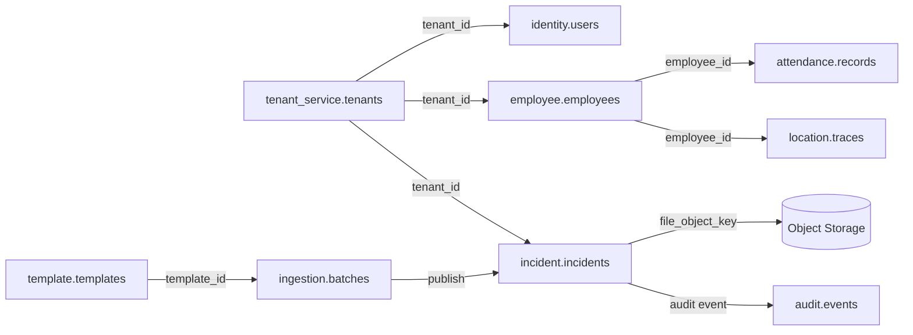

# 06 — Relaciones clave

## Relaciones intra-servicio (FK reales en PostgreSQL)

| Desde | Hacia | Cardinalidad | Servicio |
|-------|-------|--------------|----------|
| user_roles.user_id | users.id | N:1 | identity |
| user_roles.role_id | roles.id | N:1 | identity |
| role_permissions | roles, permissions | N:M | identity |
| tenant_configurations.tenant_id | tenants.tenant_id | N:1 | tenant |
| crew_members | crews, employees | N:1 | employee |
| employee_assignments | employees, sites | N:1 | employee |
| attendance_records.geofence_id | geofence_refs.id | N:1 | attendance |
| staging_rows.batch_id | ingestion_batches.id | N:1 | file-ingestion |
| template_columns.template_version_id | template_versions.id | N:1 | template-config |
| incident_activities.incident_id | incidents.id | N:1 | incident |
| ai_analysis_results.job_id | ai_analysis_jobs.id | N:1 | ai |

## Relaciones inter-servicio (UUID lógico, sin FK)



| Referencia | Origen | Destino | Sincronización |
|------------|--------|---------|----------------|
| tenant_id | Todos | tenant-service | Creado en onboarding |
| user_id | employee, audit | identity-service | Asignación explícita |
| employee_id | attendance, location | employee-service | Validación API |
| geofence_id (external) | attendance.geofence_refs | location.geofences | Evento `geofence.updated` |
| template_id + version | ingestion_batches | template_versions | HTTP en upload |
| incident_id | canonical_imported_events | incidents | Publish pipeline |
| file_object_key | evidence, batches | S3/MinIO | Upload directo |

## Flujo import → incidente

```
template-configuration (template vN)
        ↓ template_id, version
file-ingestion (batch → staging_rows → canonical_imported_events)
        ↓ HTTP/event publish
incident-service (incidents.canonical_payload)
        ↓ incident.created
audit-service + reporting-service + notification-service
```

## Integridad referencial cross-domain

Se garantiza en **capa de aplicación** (use cases), no en DB:

1. Publish valida que `tenant_id` del batch coincide con JWT.
2. `employee_id` en attendance se valida contra employee-service (cache Redis).
3. Evidencias referencian `file_object_key` existente en object storage.

## Eventos que mantienen coherencia

| Evento | Productor | Consumidores |
|--------|-----------|--------------|
| `tenant.created` | tenant-service | template-config (clone A/B), identity |
| `geofence.updated` | location-service | attendance (geofence_refs) |
| `file_ingestion.completed` | file-ingestion | reporting, audit |
| `incident.created` | incident-service | ai, notification, reporting |
| `audit.action_logged` | * | audit-service (persist) |
